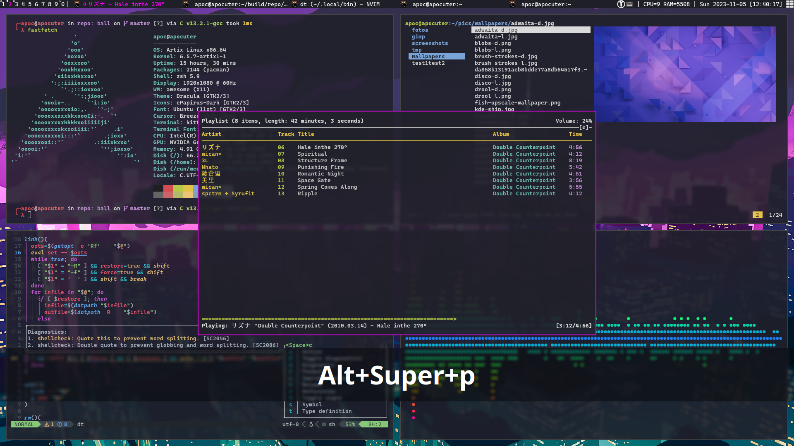

# dotfiles
config files and scripts i use.

most of my work is in [.local/bin](.local/bin), with a bunch of shell scripts. i think they're pretty useful, so check them out.

a couple scripts (as well as config files) depend on other scripts, so be sure to skim through their content if you want to copy+paste.

## Tools
### CLI

- kitty terminal, minimal changes

- neovim editor, simple config

- lf terminal file manager with ctpv previews

- zsh interactive shell, simple config with vim binds

- dash for posix scripting

### Desktop

- sxhkd keybind daemon, very important

- awesomewm with minimal config

- dunst notification daemon

#### Media

- pure alsa config available, in process of converting that to pipewire

- mpd and ncmpcpp for music

- feh and nsxiv for images

- mpv

#### Secrets

- keepassxc as password vault, important document storage, secret service provider, and TOTP generator
- keepmenu to quickly access passwords from dmenu
- syncthing to sync and backup password vault between devices

## Scripts
see the [README](.local/bin/).

these days i write some scripts in C, whose binaries are depended on by other dotfiles. they can be found in separate repos.

## Services
i've been using runit as an init system, and now i depend on it to manage a bunch of custom user services on my system. see [here](.local/var/run/runit).

the beauty of runit is you don't need the matching init system to use its services. just install runit and start it up [somehow](.zlogin).
